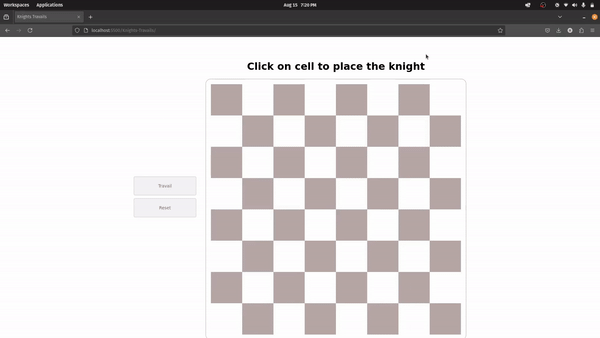

# Knight Travail Website

A website built with JavaScript, HTML, and CSS that demonstrates the Knight's Tour problem using the Breadth-First Search (BFS) algorithm.

### 🔗 **Live Demo:**

Check out the live demo of the Knight Travail website here: [Live Demo](https://rohithachar.github.io/Knights-Travails/)

## Overview

The Knight Travail website visualizes the Knight's Tour problem, where a knight moves across a chessboard visiting each square exactly once. The algorithm used to solve this problem is Breadth-First Search (BFS). This project showcases the use of BFS to explore all possible moves and find a valid tour for the knight.

## Features

- **Interactive Chessboard**: A visual representation of the chessboard where the knight’s movement is displayed.
- **BFS Algorithm**: Implementation of the BFS algorithm to find the Knight’s Tour.

## Screenshots



## Technologies Used

- **JavaScript**: For implementing the BFS algorithm and dynamic interactions.
- **HTML**: For structuring the content and layout of the website.
- **CSS**: For styling the chessboard and overall design.

## Installation

1. Clone the repository:

   ```bash
   git clone https://github.com/yourusername/knight-travail.git
   ```
